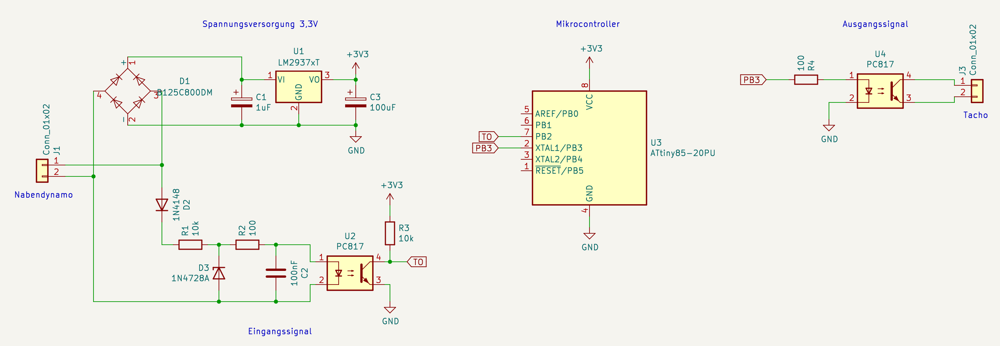
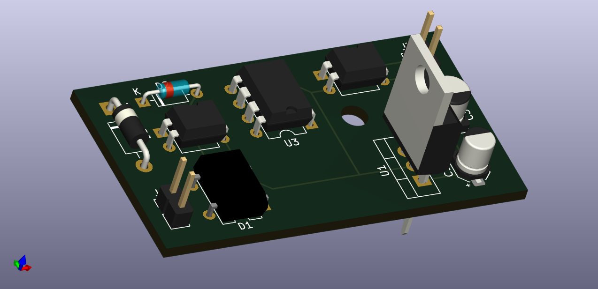
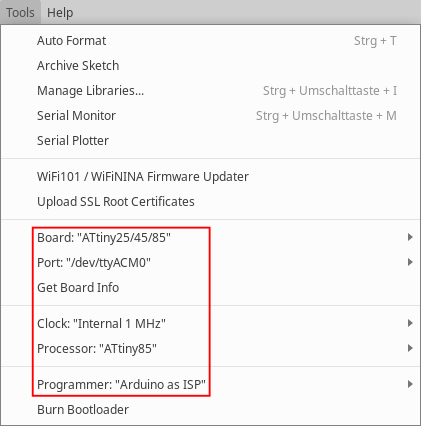
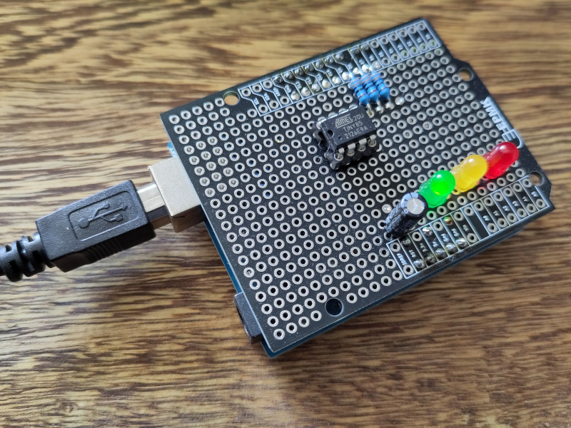
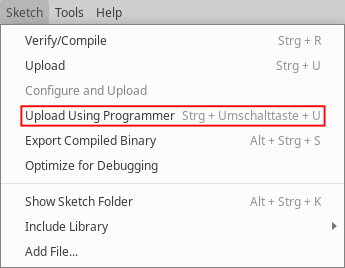

# odoconv

**odoconv** ist ein Kunstwort aus *odometer* (engl. für Hodometer bzw. Wegmesser) und *converter*.

Die hier beschriebene elektronische Schaltung konvertiert die Wechselspannung eines Nabendynamos in ein Schaltsignal, mit dem normale Sigma-Fahrradtachos angesteuert werden können.
Damit entfällt die Installation des Reedkontakts am Vorderrad.

Das macht zwar nichts wirklich einfacher, ich finde es so aber eleganter :blush:

## Projektstruktur

- `casing/` enthält das FreeCAD-Projekt für das Gehäuse.
- `circuit/` enthält das KiCAD-Projekt für die Schaltung (Schaltplan und PCB-Layout).
- `odoconv.ino` ist die Quelldatei um den ATtiny85 mit der Arduino IDE zu programmieren.

## Funktionsprinzip

Ein Nabendynamo erzeugt eine ungefilterte Wechselspannung, die Frequenz ist linear zur Drehzahl.
D.h. aus der Frequenz der Wechselspannung kann die Geschwindigkeit direkt berechnet werden.
Dafür gibt es bereits einige Tacho-Selbstbauprojekte.
Statt einen kompletten Tacho selbst zu bauen, kann man auch einfach die Frequenz teilen, um pro Umdrehung genau einen Puls zu erhalten und damit den Reed-Kontakt eines klassischen Tachos zu ersetzen.
Diese Teilung wird hier über den Zählereingang eines ATtiny Mikrocontrollers realisiert.
Dazu muss eine stabilisierte Spannung und ein definiertes Eingangssignal werden.

## Schaltungsaufbau

Die Schaltung besteht aus vier Teilen:

1. Spannungsversorgung: ein Brückengleichrichter und ein Low-Dropout-Spannungsregler erzeugen aus der Dynamo-Wechselspannung stabile 3,3V-Gleichspannung für den Mikrocontroller.
2. Signaleingang: mithilfe zweier Dioden, Widerstände und einem Glättungskondensator wird ein Optokoppler mit einer Phase der Dynamo-Spannung angesteuert. Dieser macht daraus ein sauberes Rechtecksignal für den Zählereingang des Mikrocontrollers.
3. Mikrocontroller: ein ATtiny85 fungiert als Zähler.
4. Signalausgang: ein weiterer Optokoppler schaltet das Tacho-Signal. Der Phototransistor des Optokopplers ersetzt dabei den Reed-Kontakt des Tachos.

## Teileliste

## Mikrocontroller programmieren

### Arduino IDE

In der Arduino IDE sind native Atmel Mikrocontroller standardmäßig nicht vorgesehen. Für ATtiny Mikrocontroller hat David Mellis eine passende [Bibliothek auf GitHub](https://github.com/damellis/attiny) veröffentlicht.

1. Zunächst muss unter *File -> Preferences -> Settings -> Additional boards manager URLs* diese URL eingetragen werden:  
    `https://raw.githubusercontent.com/damellis/attiny/ide-1.6.x-boards-manager/package_damellis_attiny_index.json`
2. Dann muss im *Boardmanager* die Bibliothek "**attiny** by David A. Mellis" in der aktuellen Version installiert werden.
3. Jetzt kann das korrekte Board ausgewählt werden: *Tools -> Board -> attiny -> ATtiny25/45/85*  
    
4. Als Programmer benutze ich einen *Arduino Uno* als ISP. Wie das geht, wird [hier erläutert](https://docs.arduino.cc/built-in-examples/arduino-isp/ArduinoISP). Für die korrekte Verkabelung habe ich mir einen passenden Hat gelötet.  
    
5. Für die Programmierung muss jetzt die Option *Sketch -> Upload Using Programmer* genutzt werden, sonst schlägt sie mit der Meldung `Upload error: A programmer is required to upload` fehl.  
    

### avr-gcc und avrdude

Unter Linux kann der ATtiny mithilfe des Makefiles auch ohne ArduinoIDE programmiert werden.
Dazu muss die `avr-libc` als Basisbibliothek, `avr-gcc` für das Übersetzen des Quellcodes und `avrdude` für die Programmierung per ISP installiert sein.
Für Debian-basierte Systeme z.B. so:
    `# apt-get install avr-gcc avr-libc avrdude`

Ist alles installiert, wird der Quellcode mit `make all` übersetzt.

Zur Programmierung des ATtiny wird der gleiche Aufbau mit ArduinoISP verwendet, wie im vorigen Abschnitt beschrieben. `make program` beschreibt den Mikrocontroller. Gegebenenfalls muss die Konfiguration des Programmers am Anfang des Makefiles angepasst werden.

## Limitierungen

Der eingesetzte Spannungsregler ist nur bis 25V (Peak 60V) ausgelegt.
Da die gesamte Schaltung absichtlich sehr wenig Strom verbraucht, muss am Dynamo eine zusätzliche Last, z.B. eine Lampe, betrieben werden!
Bei normaler Last pendelt sich die Dynamo-Spannung bei ca. 6,3V ein. Ohne Last steigt die Spannung quasi unbegrenzt, proportional zur Geschwindigkeit. Bei z.B. Bergabfahrten mit > 30 kmh können Spannungen über 100V auftreten, die die Schaltung nicht verträgt.

Die einfachste und gängige Lösung ist der Dauerbetrieb des Fahrradlichts.

Alternativ kann entweder ein einfaches Schaltnetzteil konstruiert werden, was die Schaltung unverhältnismäßig komplex machen würde. Oder man ersetzt die Spannungsversorgung durch eine Knopfzelle, was sinnloserweise noch eine weitere Stromquelle (neben dem Dynamo und der Tacho-Batterie) einführen würde.

## ToDo

- [ ] Signaleingang optimieren, hier könnten weniger Bauteile sein
- [ ] Die Optokoppler brauchen viel Platz, vllt können die wegoptimiert werden.
- [ ] Gehäuse als Dock für den Tacho bauen, spart Umbauten am Kabel und Platz am Fahrrad
- [ ] Programmier-/Debug-Schnittstelle für den ATTiny direkt auf der Platine
- [ ] Projektdoku zweisprachig deutsch/englisch
